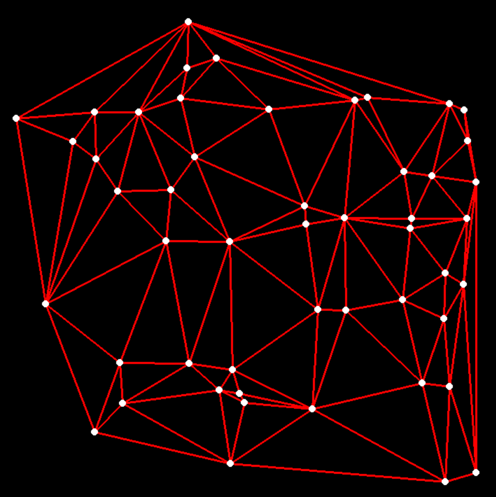
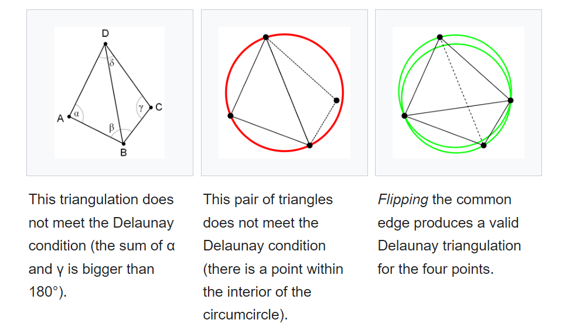

# This project
[Delaunay Triangulation](https://en.wikipedia.org/wiki/Delaunay_triangulation#cite_note-hurtado-9) in Python using Bowyer–Watson algorithm.

In computational geometry, the [Bowyer–Watson algorithm](https://en.wikipedia.org/wiki/Bowyer%E2%80%93Watson_algorithm) is a method for computing the Delaunay triangulation of a finite set of points in any number of dimensions. The algorithm can be also used to obtain a Voronoi diagram of the points, which is the dual graph of the Delaunay triangulation.

It is written with pure Python using pyGame to visualize the triangualtion. You can find more about pyGame from [here](https://www.pygame.org/).

## Delaunay Triangulation
A Delaunay triangulation of a vertex set is a triangulation of the vertex set with the property that no vertex in the vertex set falls in the interior of the circumcircle (circle that passes through all three vertices) of any triangle in the triangulation.

## Connected Project

I wrote this code as a part of my on-going [Procedural Map Generation](https://github.com/vanreusVU/Procedural-Map-Generation) project. 

## References:
* https://en.wikipedia.org/wiki/Bowyer-Watson_algorithm
* https://en.wikipedia.org/wiki/Delaunay_triangulation
* https://www.pygame.org/
* https://www.cs.cmu.edu/~quake/triangle.defs.html
